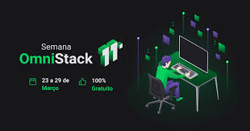

<h1 align="center">
    
</h1>

<h3 align="center">
  Project Back-End: Be The Hero
</h3>

This repository is destined to Be The Hero application developed at Week OmniStack 11.0 from Rocketseat

## About Be The Hero

It is an application developed so that ONGs can show what they support. So people can donate any amount to help.

## Technologies

- NodeJS
- Sqlite3
- Express
- Knex
- Nodemon

## How to use

To use this application you need clone this repository in you favorite directory

```
git clone git@github.com:igantonio/project-rocket-seat-omni-stack-11.0-be-the-hero.git
```

- Enter in project folder
```
cd project-rocket-seat-omni-stack-11.0-be-the-hero/back-end/

```

- Install the applications dependencies
```
npm install
```

- Init tables to Sqlite3
```
npx knex migrate:latest
```

- Run the application
```
npm start
```

- Note
```
At the root of the project it contains a file RequestsInsomnia.Json to be imported into some tool for API requests.
```


